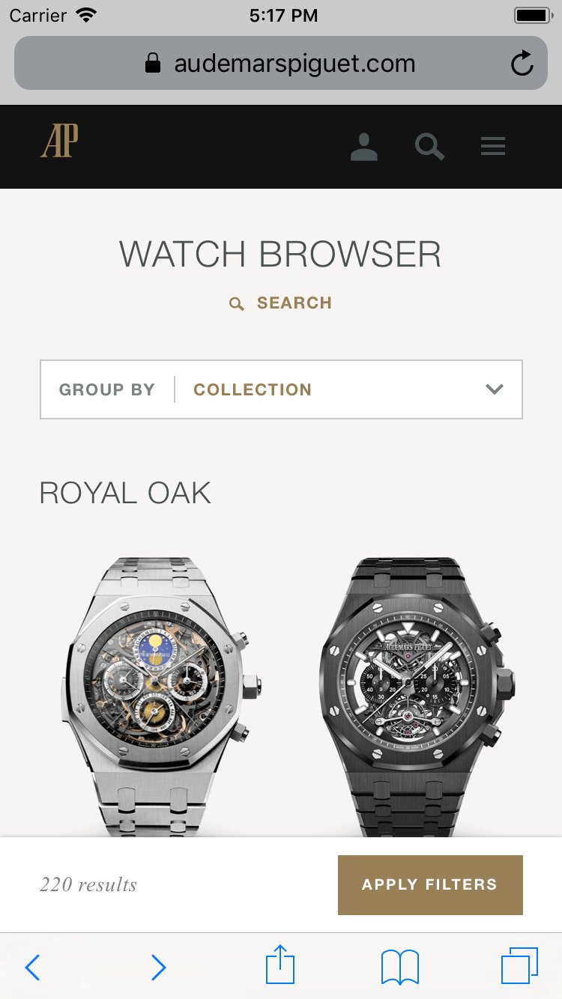
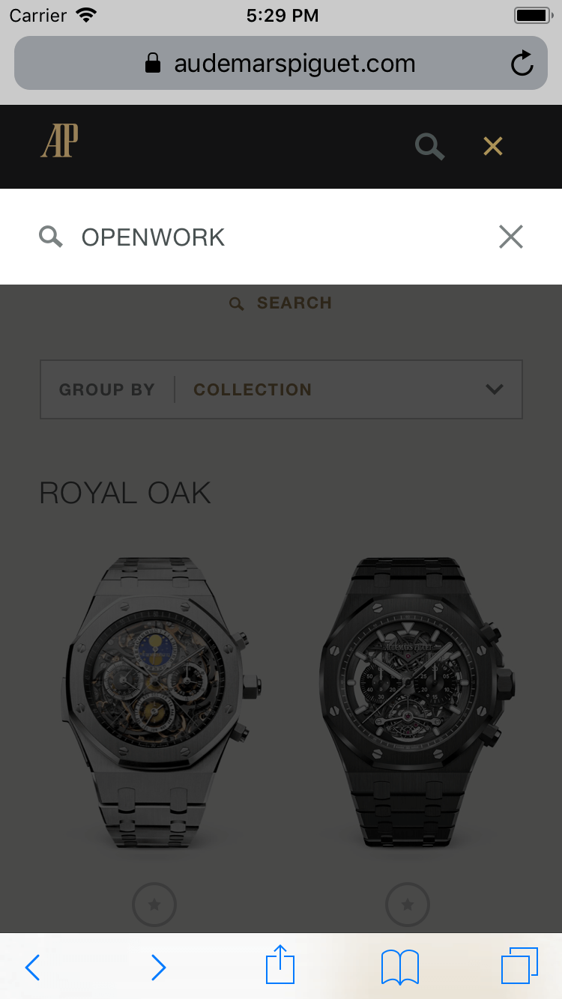

Audemars Piguet is a luxury watch maker located in Switzerland.

## AP + Odopod

Audemars Piguet and Odopod were partners for many years. Earlier in the partnership, Odopod did mostly new project work for AP. We did our best to complete maintenance items during those projects while also developing the current project, but this process inevitably lead to shortcuts and hacks that were never properly fixed. The situation improved when we started doing maintenance sprints with dedicated time to fix issues.

## Evolving

Before the responsive site which AP has now, it was developed mostly for desktop-only. Recognizing the growth of their mobile users, AP requested a mobile-specific site that used server-side browser detection to serve either mobile or desktop to the user.

In 2016, we started an effort to unify the mobile and desktop sites into a responsive site while re-platforming from Symfony to Laravel and implementing a more modern and bold design. Some old pages which were not being redesigned yet, however, had to remain the same. Fortunately, webpack is very flexible and I was able to configure it to work for the project's needs, exposing globals and importing files as if they were included as a `<script>`. As more pages were designed and updated (or removed), I was able to move the project away from `<script>`-soup, delete lots of legacy code, manage the dependencies with npm, and unify the mess of desktop/mobile/shared JavaScript into modern developer experience.

AP went from a project which Odopod developers were apprehensive to work on to one of the best projects in the studio.

## Strap browser

Some AP watches come with a range of case and strap options to choose from. For the Millenary collection, I created case and strap browser that allowed users to preview what their case would look like with different straps to find the best combination that matches their style.

<!-- markdownlint-disable MD033 -->
<video muted playsinline controls loop poster="/strap-browser-poster.png">
  <source src="strap-browser.webm" type="video/webm; codecs=vp9,vorbis">
  <source src="strap-browser.mp4" type="video/mp4">
</video>

My version of the strap browser is no longer live, but you can check out the [new version](https://www.audemarspiguet.com/en/strap-browser/).

## [Watch browser](https://www.audemarspiguet.com/en/watch-browser/)

The watch browser gives users the ability to find their favorite watch from over 500 models by filtering 20+ facets.

The current watch browser is visually similar to the old one, but I completely rewrote the Backbone app with a focus on speed. Our backend developer updated the watch data model and I worked with [him](https://kevinking.io/) to transform and optimize the old APIs powering the app. I spent time profiling the app with Chrome's DevTools to optimize rendering.

| Mobile view | Search on mobile |
|:-----------:|:----------------:|
| | |

Here are the desktop filters in action:

<video muted playsinline controls loop poster="/watch-browser-poster.png">
  <source src="watch-browser.webm" type="video/webm; codecs=vp9,vorbis">
  <source src="watch-browser.mp4" type="video/mp4">
</video>
